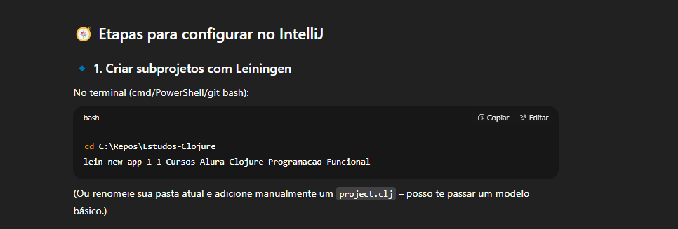
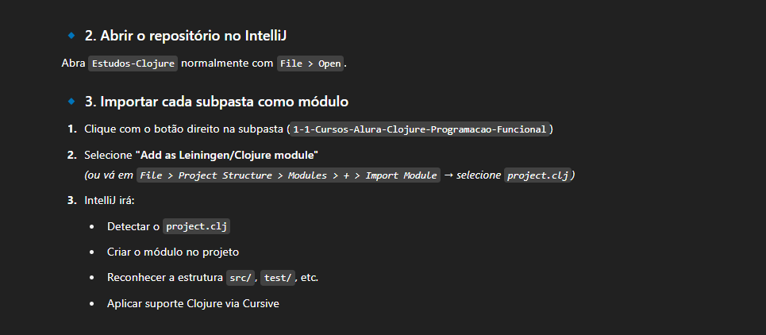
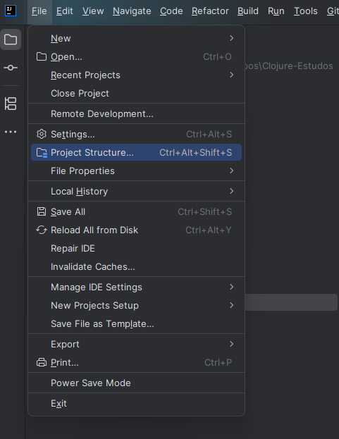
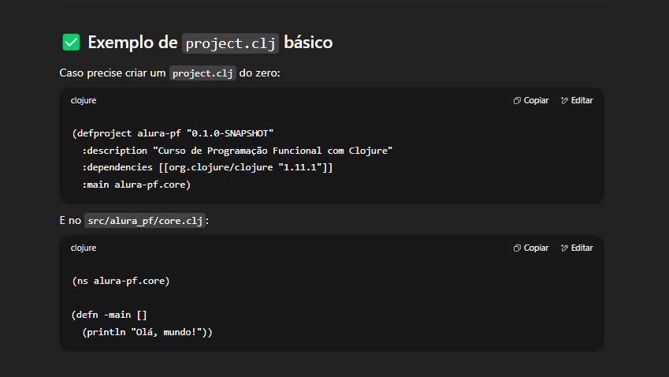

# Passo a passo para projetos clojures de estudos na IDE

# Comandos úteis

`clj` -> clj abre terminal do clojure

`lein create` -> Comando para criar um projeto na estrutura `leiningen` `default -> Library` || `app Application Template`

## Comandos úteis repl

`use '{{NAMESPACE}}.{{FILE}` -> Para importar o arquivo no repl para fins de testes